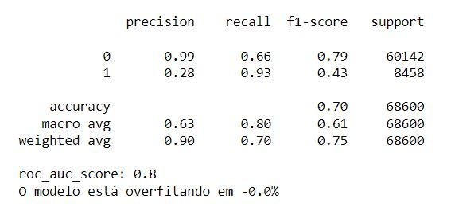
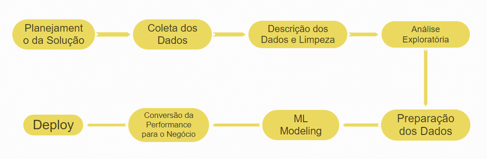

# Insurance All Company
## Predicting Insurance Cross Sell

## 1.0 Problema de Negócio:
### A Empresa Insurance All
A Insurance All é uma empresa que fornece seguro de saúde para seus clientes e o time de produtos está analisando a possibilidade de oferecer aos assegurados, um novo produto: Um seguro de automóveis.

Assim como o seguro de saúde, os clientes desse novo plano de seguro de automóveis precisam pagar um valor anualmente à Insurance All para obter um valor assegurado pela empresa, destinado aos custos de um eventual acidente ou dano ao veículo.

A Insurance All fez uma pesquisa com cerca de 380 mil clientes sobre o interesse em aderir a um novo produto de seguro de automóveis, no ano passado. Todos os clientes demonstraram interesse ou não em adquirir o seguro de automóvel e essas respostas ficaram salvas em um banco de dados junto com outros atributos dos clientes.

O time de produtos selecionou 127 mil novos clientes que não responderam a pesquisa para participar de uma campanha, no qual receberão a oferta do novo produto de seguro de automóveis. A oferta será feita pelo time de vendas através de ligações telefônicas.

Contudo, o time de vendas tem uma capacidade de realizar 20 mil ligações dentro do período da campanha.

### O Desafio
Nesse contexto, você foi contratado como um consultor de Ciência de Dados para construir um modelo que prediz se o cliente estaria ou não interessado no seguro de automóvel. 

Com a sua solução, o time de vendas espera conseguir priorizar as pessoas com maior interesse no novo produto e assim, otimizar a campanha realizando apenas contatos aos clientes mais propensos a realizar a compra.

Como resultado da sua consultoria, você precisará entregar um relatório contendo algumas análises e respostas às seguintes perguntas:

1. Principais Insights sobre os atributos mais relevantes de clientes interessados em adquirir um seguro de automóvel.
2. Qual a porcentagem de clientes interessados em adquirir um seguro de automóvel, o time de vendas conseguirá contatar fazendo 20.000 ligações?
3. E se a capacidade do time de vendas aumentar para 40.000 ligações, qual a porcentagem de clientes interessados em adquirir um seguro de automóvel o time de vendas conseguirá contatar?
4. Quantas ligações o time de vendas precisa fazer para contatar 80% dos clientes interessados em adquirir um seguro de automóvel?
5. Criar uma API de request.

Projeto retirado do Blog Seja Um Data Scientist
https://sejaumdatascientist.com/como-usar-data-science-para-fazer-a-empresa-vender-mais/

Projeto original disponível na plataforma Kaggle
https://www.kaggle.com/anmolkumar/health-insurance-cross-sell-prediction

## 2.0 Ferramentas e Requisitos:
* Linguagem: Python
* Desenvolvimento e entrega do projeto: Jupyter Notebook
* Cloud: Heroku
* Plataforma de Request: Google Sheets

## 3.0 Premissas:
* A variavel resposta (Response) será considerada neste projeto como uma aquisição real de seguro de automóvel, ainda que neste problema fictício ela representa somente uma resposta para uma mera pesquisa.
* Cada aquisição de seguros de automóvel trará para a empresa uma margem líquida de $5,000.00 ao ano.
* Cada ligação tem um custo de 16 dólares.

## 4.0 Planejamento da Solução:
###### 4.1 Objetivos:
1. Principais Insights sobre os atributos mais relevantes de clientes interessados em adquirir um seguro de automóvel.
2. Qual a porcentagem de clientes interessados em adquirir um seguro de automóvel, o time de vendas conseguirá contatar fazendo 20.000 ligações?
3. E se a capacidade do time de vendas aumentar para 40.000 ligações, qual a porcentagem de clientes interessados em adquirir um seguro de automóvel o time de vendas conseguirá contatar?
4. Quantas ligações o time de vendas precisa fazer para contatar 80% dos clientes interessados em adquirir um seguro de automóvel?
5. Criar uma API de request.

###### 4.2 Estratégia de Solução:
1. Gráficos e estudos de como as features se relacionam com a variávei alvo, individualmente ou combinadas através de Exploratory Data Analysis e Descriptive Statistics.
2. Treinar um modelo de Machine Learning, scorar os clientes, priorizar os clientes segundo suas probabilidades de sucesso, criar uma curva lift para criar cenários com os 20.000 melhores.
3. Utilizar do modelo anterior e criar cenários com os 40.000 melhores.
4. Utilizar do modelo anterior, e identificar o ponto de corte de 80% na curva lift.
5. Fazer deploy no Heroku e disponibilizar em cloud através do Google Sheets

###### 4.3 Inputs:
* Problema de negócio
* Conjunto de dados com características de 380.000 clientes e as suas respostas sobre interesse em adquirir um seguro de automóveis.

###### 4.4 Outputs:
* Pergunta 1: Um texto, em Jupyter Notebook
* Pergunta 2: Um número, em Jupyter Notebook
* Pergunta 3: Um número, em Jupyter Notebook
* Pergunta 4: Um número, em Jupyter Notebook
* API com request por Google Sheets do tipo: | v1 | v2 | v3 | vn - 1/0

###### 4.5 Steps:
1. Pipeline de dados, funcional, de ponta a ponta (desde a coleta de dados até o 
    treinamento do modelo)
2. Entender os dados e limpa-los (buscar inconsistências) Análises de estatística
    descritiva de primeira ordem
3. Feature Engineering (criar variáveis que modelam o fenômeno)
4. Criar as hipóteses de negócio
5. Análise exploratória de dados para validar ou refutar hióteses
6. Balancear os dados
7. Definir métricas e treinar o modelo
8. Analisar métricas
9. Scorar clientes
10. Criar arquivo handle para todas as transformações necessárias
11. Criar API
12. Implementar um request através de Google Sheets
10. Resultados e Conclusão

## 5.0 Top 3 Data Insights:
1. Clientes que já possuem seguro de automóvel dificilmente fecharão um contrato. 
2. Clientes que já sofreram danos e acionaram o sinistro no passado são mais propensos a fechar um contrato.
3. A região 28 contém 28% da base e tem uma média de Response de 18% de negócios fechados, bem acima da média geral.

## 6.0 Machine Learning Aplicado:
XGboost Classifier (falta implementar cross validation e configurar hiperparâmetros)

## 7.0 Performance do Modelo:

## 8.0 Resultados Financeiros:
Em construção...

## 9.0 Conclusões:
Em construção...

## 10.0 Lições Aprendidas:
Com este projeto eu aprendi a desenvolver um sistema de ranqueamento de clientes (learning to rank), muito eficiente quando há uma base grande de clientes em potencial, mas realizar a oferta para tais clientes tem um custo associado ou um recurso finito de operadores. Em resumo, realizar um ranqueamento faz com que os clientes mais propensos a comprar o produto sejam contatados primeiro, e os menos propensos fiquem para o final da fila.

## 11.0 Deploy:
API de requests de predições hospedada no Heroku através do link
https://insurance-sales-predict.herokuapp.com/predict

Orientações para o request: 
* Dataframe raw integral contendo index e response (apenas para estudo)
* Mínimo de duas amostras
* Formato json com orient do tipo records

## 12.0 Próximos Passos: 
* Entender melhor a feature Policy_sales_channel, ela pode ser impactante no momento de efetuar um contato de venda, os canais 26, 124 e 156 apresentam por volta de 20% de interesse no produto, número bem acima da média global.

## 13.0 Estágio do Projeto: 
Conversão de métricas da performance do modelo em resultados financeiros

## 14.0 Sumário:
* Id: identificador único do cliente.
* Gender: gênero do cliente.
* Age: idade do cliente.
* Driving License: 0, o cliente não tem permissão para dirigir e 1, o cliente tem para dirigir ( CNH – Carteira Nacional de Habilitação )
* Region Code: código da região do cliente.
* Previously Insured: 0, o cliente não tem seguro de automóvel e 1, o cliente já tem seguro de automóvel.
* Vehicle Age: idade do veículo.
* Vehicle Damage: 0, cliente nunca teve seu veículo danificado no passado e 1, cliente já teve seu veículo danificado no passado.
* Anual Premium: quantidade que o cliente pagou à empresa pelo seguro de saúde anual.
* Policy sales channel: código anônimo para o canal de contato com o cliente.
* Vintage: número de dias que o cliente se associou à empresa através da compra do seguro de saúde.
* Response: 0, o cliente não tem interesse e 1, o cliente tem interesse.
